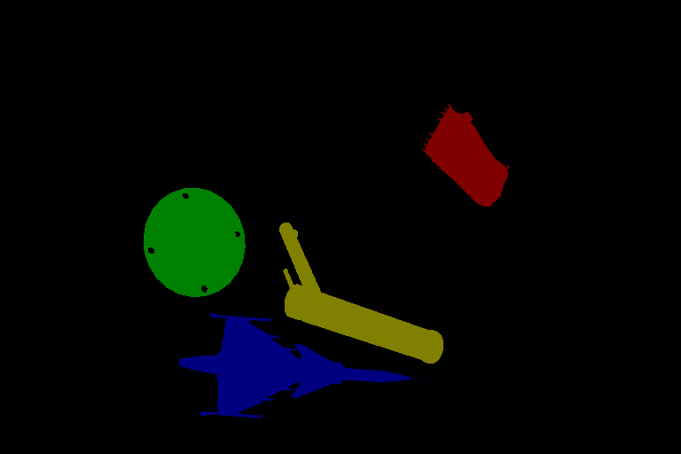
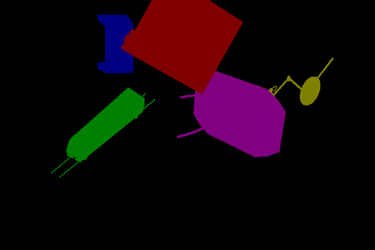

# Blender VOS Renderer

This is a fork of [BlenderProc](https://github.com/DLR-RM/BlenderProc).
It is used to generate the BL30K dataset.
The original functions of BlenderProc are mostly crippled by my (hacky) modifications to this repo.

## BL30K

BL30K is a synthetic dataset rendered using Blender with ShapeNet's data. We break the dataset into six segments, each with approximately 5K videos.
The videos are organized in a similar format as DAVIS and YouTubeVOS, so dataloaders for those datasets can be used directly. Each video is 160 frames long, and each frame has a resolution of 768*512. There are 3-5 objects per video, and each object has a random smooth trajectory -- we tried to optimize the trajectories in a greedy fashion to minimize object intersection (not guaranteed), with occlusions still possible (happen a lot in reality). See [MiVOS](https://github.com/hkchengrex/MiVOS/#bl30k) for details.

Download here: [One Drive](https://hkustconnect-my.sharepoint.com/:f:/g/personal/hkchengad_connect_ust_hk/EhQLhKWJcVVGgTSWIpwYaGgBTbG7fDeHh8hgLsBTKBGvBA?e=eU9R5l)

Examples:
| Image | Annotation |
| :---: | :---: |
|  |  |
|  |  |
|  |  |
|  |  |

## Generation

1. First download all required data and generate a list of yaml files. [Instructions here](https://github.com/hkchengrex/MiVOS/#generation).
2. Run the following command:

```bash
python pool_run.py --models <path_to/ShapeNetCore.v2> --textures <path_to/Texture> --yaml <path_to/yaml> --output <output directory> -d <GPU ID> -N <Number of parallel processes>
```

## Citation

Please cite our paper (and the original BlenderProc) if you find this repo/data useful!

```bibtex
@inproceedings{MiVOS_2021,
  title={Modular Interactive Video Object Segmentation: Interaction-to-Mask, Propagation and Difference-Aware Fusion},
  author={Cheng, Ho Kei and Tai, Yu-Wing and Tang, Chi-Keung},
  booktitle={CVPR},
  year={2021}
}
```
